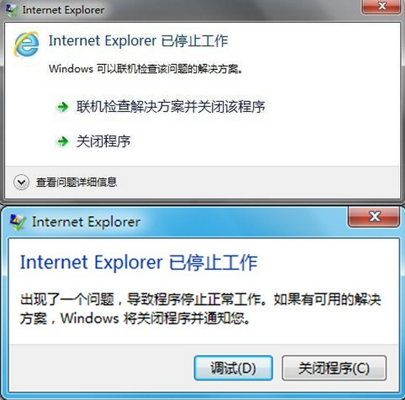
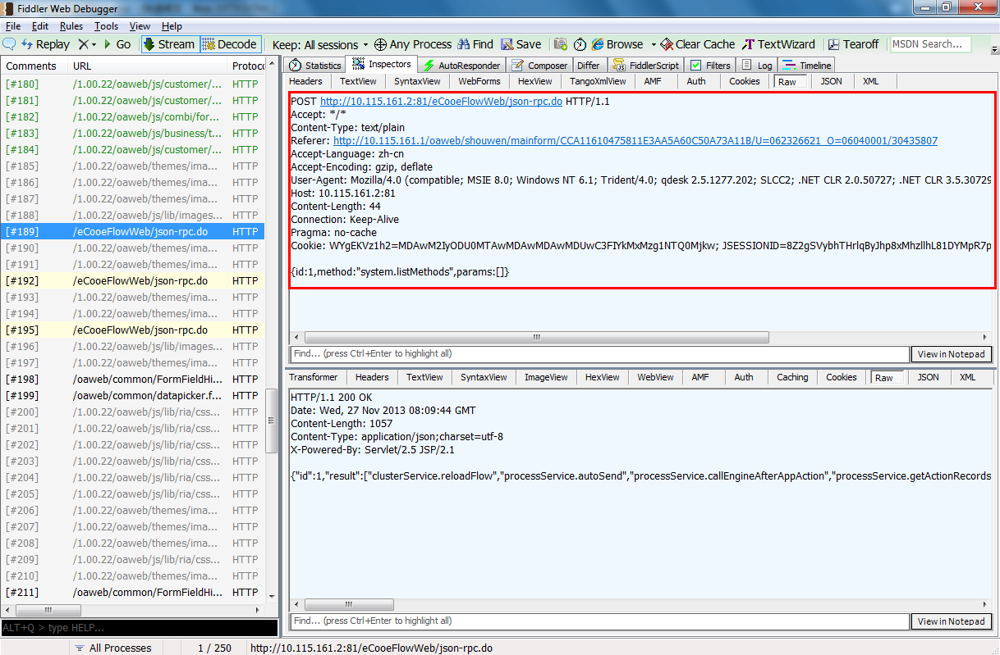
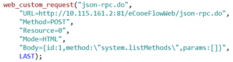
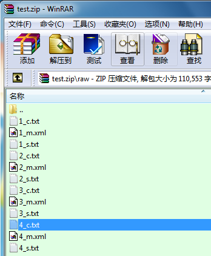

## 背景介绍

​在当前阶段，利用性能测试工具LoadRunner对B/S架构类应用系统进行脚本录制时经常会出现因异常报错而无法完成脚本录制工作的情况，该问题一直困扰着广大性能测试工作者，且始终没有一个彻底的解决方案。

脚本录制时IE浏览器异常显示如下：

对于B/S架构系统的性能测试，录制脚本是第一步，若脚本无法录制，则无法开展后续的测试工作。

## 解决思路

在利用网络抓包工具Fiddler对通讯数据进行抓包时，所有浏览器端请求和服务器端响应均成功地被记录下来，抓包过程中IE浏览器也没有出现异常退出的情况。

因此，我们完全可以利用抓包工具Fiddler抓取得到的数据包，将其中的每一个请求人工转换为LoadRunner所能识别的函数，从而绕过LoadRunner录制功能方面的缺陷，形成LoadRunner脚本。

例如，进行“打开公文表单”操作时，录制得到的通讯交互中其中一条请求如下图所示：

相应地，转换为LoadRunner函数如下所示：

对于Web/HTTP协议的应用系统，通讯交互过程中的请求类型主要有两种，GET和POST，均可以用函数web_custom_request进行模拟；因此，参照web_custom_request的函数说明，可以将所有请求人工转换为web_custom_request函数，最终便可得到性能点对应的LoadRunner性能测试脚本。

然而，通讯数据包中的请求数量往往较多，针对每一条请求人工地进行转换将会耗费大量的时间和精力。针对该情况，从Fiddler抓包保存得到的存档文件入手进行分析。

利用Fiddler对通讯交互数据进行抓包，存档保存为SAZ文档。SAZ文档其实就是ZIP文档，将后缀.saz改为.zip后完全可以利用ZIP文档解压工具进行解压。

在SAZ文档中，包含有两个文件（_index.htm和[Content_Types].xml）和一个文件夹（raw）；在raw文件夹中包含了存储所有web session的文件。
针对每一个web session，存在3个文件，sessid#_c.txt，sessid#_s.txt和sessid#_m.xml。其中sessid#_c.txt包含了客户端的原始请求；例如，对于前面提到的同一个POST请求，对应的文件内容如下图所示：

我们可以根据其中的内容来构造HTTP请求，参照web_custom_request的函数说明，将其转换成为web_custom_request函数，最终形成LoadRunner测试脚本。

## 具体实现方式

- 加载saz文件，将其转换为zip文件；
- 加载zip文件，获取其中raw文件夹下所有sessid#_c.txt文件，并读取其内容，存储为clientRequestList；
- 对于clientRequestList中的每一条请求，参照web_custom_request的函数说明，依次转换成为web_custom_request函数，最终形成LoadRunner测试脚本。
