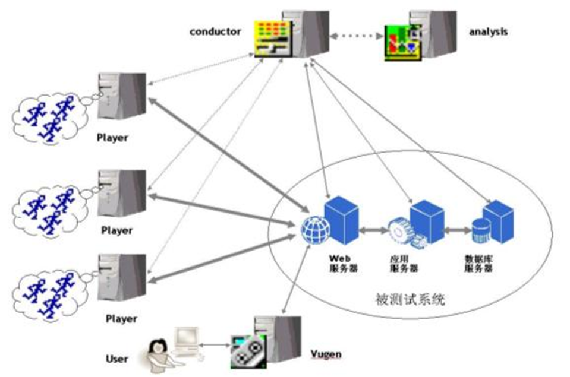
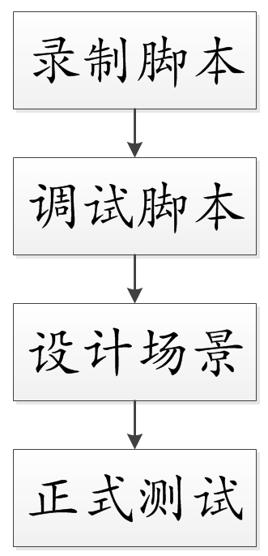
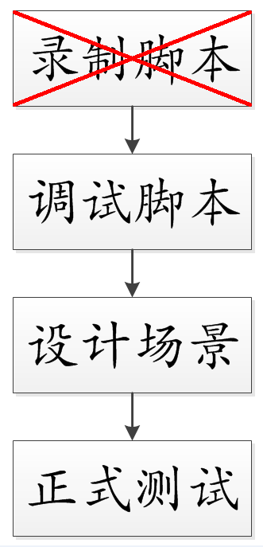
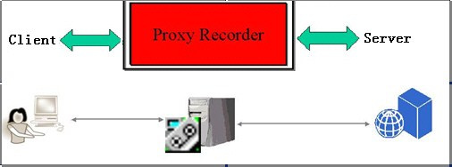
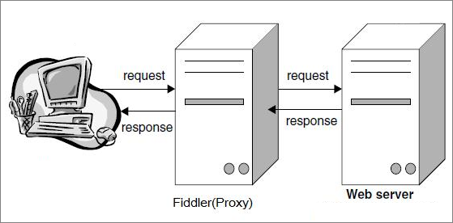
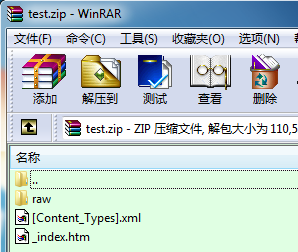
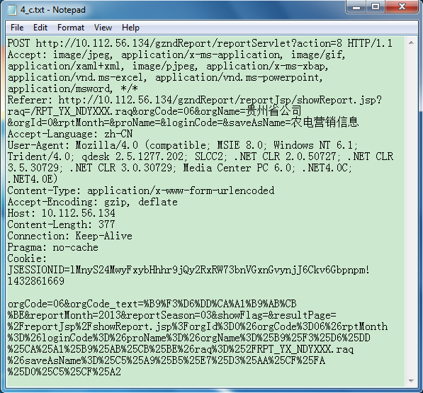

% 对LoadRunner脚本录制缺陷方面的改进
% 李隆
% April 29, 2014

# LoadRunner测试流程简介

## LoadRunner原理图

## LoadRunner测试流程

# 问题及现象

## 脚本录制时IE浏览器异常

## 问题影响分析

# 分析思路

## LoadRunner脚本录制原理

## LoadRunner录制脚本分析

- web_url
- web_submit_form
- web_submit_data
- web_image
- web_custom_request

## Fiddler2 抓包工具的引入

## Fiddler2抓包数据图示

## 手工编写脚本

## 初步思路

1、获取被测性能点的所有业务请求数据。
2、读取每一条HTTP请求，对其请求内容进行分析。
3、将所有HTTP请求逐个转换为LoadRunner函数。

## 存在的问题

- 手工转换工作繁杂，耗费大量时间和精力
- 手工转换工作依赖测试人员个人能力，不易推广

# 解决方案

## saz文档格式分析

## 程序实现思路

- 加载.saz文件，将其转换为.zip文件；
- 加载.zip文件，获取其中raw文件夹下所有sessid#_c.txt文件，并读取其内容，存储为clientRequestList；
- 对于clientRequestList中的每一条请求，参照web_custom_request的函数说明，依次转换成为web_custom_request函数，最终形成LoadRunner测试脚本。

